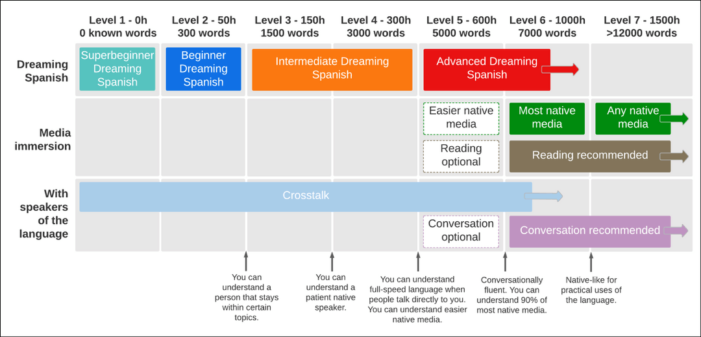
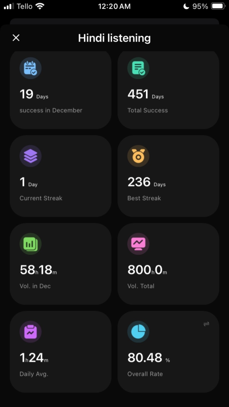
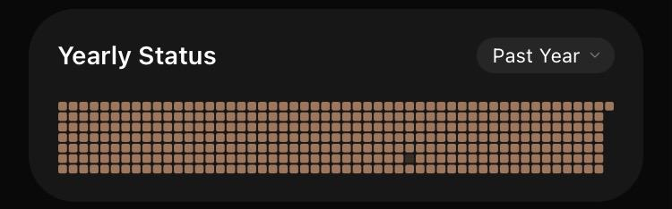

Things I'll cover in this post:
- My story of learning hindi
- Where I started
- When I started seriously learning hindi
- What I did to learn
- What I plan on doing going forward

I have been acquiring/learning Hindi off and on for years. Sometimes through more traditional methods, and sometimes through just natural immersion. The traditional methods mixed with reading and speaking too early on, set me back in my language learning journey. There was too much concsious learning and practice early on which fucked up my accent and caused me to not have natural native like grammar. That being said, thanks to the natural immersion and comprehensible input that I did do, I did still acquire a good bit of Hindi. 

About 1.5 years ago, I decided I wanted to finally take learning Hindi more seriously and hopefully undo the damage I did as well as see actual growth. I was always familiar with Stepehn Krashen's [Input Hypothesis](https://en.wikipedia.org/wiki/Input_hypothesis) and liked the idea of learning a language through just comprehensible input. The problem was, I didn't know if it was actually possible nor did I really know what comprehensible input would actually look like. I only fully understand how this theory could be applied successfully once I discovered [Automatic Language Growth (ALG)](https://en.wikipedia.org/wiki/J._Marvin_Brown#Automatic_Language_Growth) and [Dreaming Spanish](https://www.dreaming.com/). They essentially provided the blueprint for me going forward. The Dreaming Spanish roadmap was the perfect roadmap for me to stay on track. 

   The Dreaming Spanish Roadmap.

Unfortunately, since I wasn't using ALG from the beginning, I had no idea how many hours of input I had actually done, so I had to guess based on the different level descriptions. After reading through the full description for Level 5 though which I found in [this pdf](../Documents/ds_roadmap.pdf), it seemed to fit me and the level I felt I was at perfectly. 

> You can understand people well when they speak
directly to you. They won’t need to adapt their speech
for you. Understanding a conversation between native
speakers is still hard. You’ll almost understand TV
programs in the language, because you understand so
many of the words, but they are still hard enough to
leave you frustrated or bored. Conversation can be
tiresome, and if you try to speak you can feel a bit like a
child, since it will be hard to express abstract concepts
and complex thoughts. You understand most of the
words used during daily conversation, but you still can’t
use many yourself. If you try to speak the language, it
will feel like you are missing many important words.
However, you can, often, already speak with the correct
intonation patterns of the language, without knowing why,
and even make a distinction between similar sounds in
the language when you say them out loud.
   
Next, I needed to figure out how many approximate hours of input this meant I had under my belt. Dreaming Spanish says to take the roadmap estimated hours of input and double them if the language you are learning is quite different from your native language. This meant that I had about 1,200 hours of input done already with 800 hours to get to the next level of 2000 (i.e. level 6 out of 7). I started 2025 off with exactly 300 tracked hours. That meant I had 500 more to go if I wanted to hit level 6 out of 7 on the roadmap. It's January 1st now, just a few minutes after midnight, and I'm happy to say that I did hit 800 tracked hours before the year ended which should put me at approximately 2,000 hours and level 6 out of 7.

   
I tracked my stats using the iPhone app [Habit](https://apps.apple.com/us/app/habit-tracker/id1438388363), but you can also use [Loop Habit Tracker](https://play.google.com/store/apps/details?id=org.isoron.uhabits&hl=en) for android which I actually prefer.   

So what did my method actually look like? Since, I was already at level 5 out of 6 a lot of easier native content was accessible to me. Even the content that was more difficult I would just listen to anyway. I definitely priortized quantity over quality of input. Which I know doesn't produce the best results, but the way I chose to look at is any results are better than no results. The reason being if I agonized over getting the perfect CI input, and then made sure I was 100% fully paying attention the whole time while listening, I just never would have done any CI input. So that being said, I put on whatever content I could find in the background while living my life, podcasts, youtube videos, shitty romance audiobooks, classic and popular audiobooks (translated into Hindi of course) like 1984 and The Alechemist. I prioritized just creating the habit of listening as opposed to making sure I was doing things in the ideal way. This meant that I would listen to input while doing house chores, commuting, or even while playing video games that don't require a lot of focus, games without any text or words like simple platformers. Once again, obviously not ideal input, but it works for me. I was immersing in the language.

The biggest gamechanger for me was turning my daily listening goal into an unskippable habit. It was very inconvenient at times, but I made it my rule for awhile that I simply wouldn't go to bed if I hadn't completed my listening for the day. My daily goal started out small with just 20 minutes a day, but then I slowly increased this amount more and more until it was eventually 1 hour a day of daily listening. I found that while my larger goals seemed so distant and far away seeing my daily progress was extremely rewarding. It let me go to sleep everyday with a sense of accomplishment. Even if I had a lazy day or felt I didn't accomplish much I could always point towards this one tiny step of progress towards my larger goals. Additionally, seeing my streak grow everyday had created a positive feedback loop where I would be more motivated to do it everyday. It naturally provided short term goals to shoot for as well. Ultimately I was able to hit a 365 day streak minus one sad little day in the middle where I essentially slept all day.  

   
My one year streak. Each colored in box represents a day where I met my minimum goal (which slowly increased with time).   

With all of that being said and done. I am very proud of myself for the growth and consistency I've be able to attain in this hobby. I've always wanted to be able to have measurable results and really stay consistent with a habit. I plan on continuing to do projects and goals like this. However, I feel like I certainly need a break from listening. It has been good, but it also feels like I wasn't able to be as present in my life at times as I would have liked. The larger goal for the year felt like a lot and starting off with a small daily goal meant I had to play catchup during the latter part of the year. Going forward I plan on continuing to listen to Hindi in this upcoming year, but certainly not everyday. I think it will be just whenever I feel like it. My main goal is going to be to shift into reading actually as the DS roadmap and ALG recommend reading at these later stages. My goal for the year will be to read 1 million words in Hindi. It might end up needing to be a two year goal, but I'll see how it goes! Getting into reading has been something I've looked forward to for a long time in Hindi, and while 1 million words certainly seems like a lot, I will most likely read the Harry Potter series in Hindi to attain this (If I'm able to). So that's it. That's my year in review for learning Hindi as well as how I got to where I am, and where I plan on going. Happy new year!